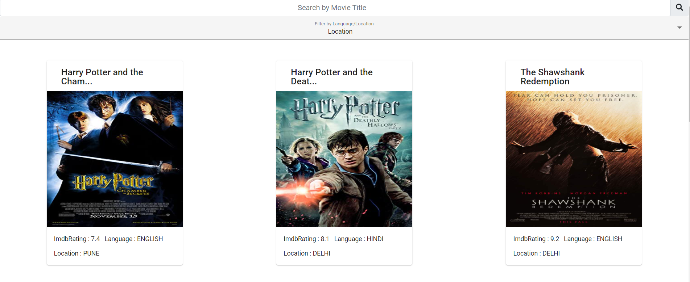
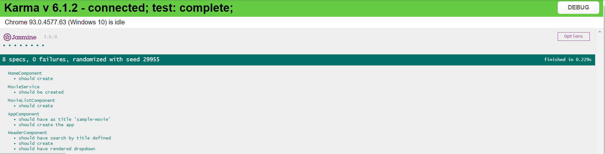

# SampleMovie

This project frontend  was generated with [Angular CLI](https://github.com/angular/angular-cli) version 11.2.10.

## Development server

Run `ng serve` for a dev client  server. Navigate to `http://localhost:4200/`. The app will automatically reload if you change any of the source files.

## Server Side API

Navigate to API directory and to Movie API and run the solution to start the Server 

## Build

Run `ng build` to build the client side project. The build artifacts will be stored in the `dist/` directory. Use the `--prod` flag for a production build.

## Running unit tests

Run `ng test` to execute the client-side unit tests via [Karma](https://karma-runner.github.io).
Navigate to API directory and MovieAPITest for running Server side test cases. 

## Screenshots
 
 